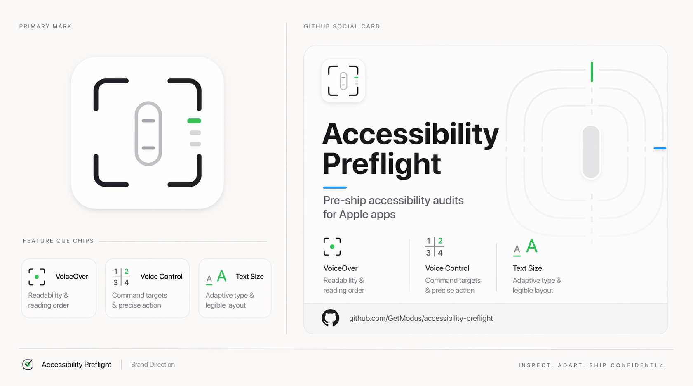

## Accessibility Preflight



`accessibility-preflight` is an iOS-first Swift CLI for Apple app accessibility audits.

It is built for teams who want one repeatable pre-ship pass that:
- runs static source checks
- verifies a real app build
- audits declared iOS screens in Simulator
- produces review-gated remediation artifacts instead of silently rewriting app code
- leaves explicit manual follow-up for VoiceOver, Voice Control, Dynamic Type, and keyboard checks

Current status: `developer preview`

The tool is strongest today on iOS. macOS support is real, but narrower: build-and-launch proof plus assisted follow-up rather than full parity with the iOS audit lane.

### Why This Exists

This tool comes from years of watching otherwise good Apple apps break accessibility in the same predictable ways.

Part of that perspective comes from working alongside Apple's accessibility team and seeing the same avoidable failures show up again and again:
- VoiceOver lands on controls that were never labeled correctly
- text sizing breaks layouts, truncates critical actions, or pushes paywalls and onboarding flows out of reach
- Voice Control runs into duplicate or ambiguous visible labels
- teams assume accessibility is "mostly fine" because no one has a repeatable release check

For the last six years, the pattern has been consistent: many accessibility failures are not malicious or exotic, they are setup failures that ship because teams do not have enough visibility before release.

That hurts users and product teams at the same time. Accessibility users are active users who want to use great apps, complete flows, and pay for subscriptions like everyone else. When an app does not work with VoiceOver, Voice Control, or larger text sizes, they do not get the product value, and teams lose trust, retention, and revenue they could have kept.

`accessibility-preflight` exists to change that by making accessibility readiness a deliberate, repeatable part of the shipping workflow instead of an afterthought.

### What It Does Today

#### iOS
- discovers an Apple app target and runs static accessibility checks
- builds the app for Simulator
- proves clean install + relaunch of the same build
- runs the Apple XCTest accessibility audit on the current screen
- runs a declared multi-screen audit matrix when semantic snapshot integration is installed
- captures remediation artifacts and semantic-integration artifacts as standalone review bundles
- prints short checklists and fuller manual assistive-tech workflows

#### macOS
- discovers a macOS app target
- builds and launches the app
- reports assisted follow-up for VoiceOver, keyboard traversal, and focus review

### What It Does Not Claim Yet

- full iOS + macOS feature parity
- hands-free VoiceOver or Voice Control verification
- authoritative accessibility sign-off without human review
- silent code modification during preflight

More detail lives in [docs/SCOPE.md](docs/SCOPE.md) and [docs/ROADMAP.md](docs/ROADMAP.md).

### Quick Start

From this package directory:

```bash
swift run accessibility-preflight help
swift run accessibility-preflight preflight /path/to/apple-app
swift run accessibility-preflight preflight /path/to/apple-app --json
```

From the monorepo root:

```bash
swift run --package-path tools/accessibility-preflight accessibility-preflight help
```

Optional local shim install:

```bash
scripts/install-local.sh
accessibility-preflight help
```

### Commands

```bash
accessibility-preflight preflight /path/to/apple-app
accessibility-preflight static /path/to/apple-app
accessibility-preflight ios-run /path/to/apple-app
accessibility-preflight macos-run /path/to/apple-app
accessibility-preflight report --input report.json
accessibility-preflight checklists --platform ios
accessibility-preflight checklists --platform macos
accessibility-preflight manual-workflows --platform ios
accessibility-preflight manual-workflows --platform macos
accessibility-preflight apply-artifact --artifact /path/to/artifact --branch codex/accessibility-review
```

### Review-Gated Remediation

This tool is intentionally proposal-first.

- `preflight` does not silently patch the target app
- actionable findings generate a standalone remediation bundle under `.accessibility-preflight/remediation/<project-slug>/`
- missing semantic integration generates a standalone bundle under `.accessibility-preflight/semantic-integration/<app-slug>/`

Each remediation bundle contains:
- `README.md`
- `manifest.json`
- `changes.patch`

Recommended flow:

1. Run `accessibility-preflight preflight /path/to/apple-app`
2. Review the generated artifact
3. Apply it only on a dedicated review branch
4. Re-run preflight after the approved changes land

Example:

```bash
accessibility-preflight apply-artifact \
  --artifact /path/to/apple-app/.accessibility-preflight/remediation/myapp \
  --branch codex/accessibility-review
```

### Manual Assistive-Tech Workflows

The automated pass is only half the story. Use the built-in manual workflow command after a clean run:

```bash
accessibility-preflight manual-workflows --platform ios
accessibility-preflight manual-workflows --platform macos
```

Those workflows make the human lane explicit:
- iOS: VoiceOver, Voice Control, Dynamic Type
- macOS: keyboard traversal, VoiceOver, display accommodations

The shorter command:

```bash
accessibility-preflight checklists --platform ios
```

is meant for a quick pass. The manual workflow command is the fuller release-review version.

### Repository Layout

- `Package.swift`: SwiftPM entry point
- `Sources/`: CLI, runtime verifiers, static rules, report rendering
- `Tests/`: package test suite
- `Harnesses/`: iOS accessibility audit harness assets
- `Templates/`: semantic integration templates
- `assets/`: SVG artwork for GitHub and docs
- `docs/`: scope, roadmap, workflows, and release guidance

### GitHub Prep

Examples live in [docs/EXAMPLES.md](docs/EXAMPLES.md).
Launch copy and release notes live in [docs/GITHUB-LAUNCH.md](docs/GITHUB-LAUNCH.md).

Before publishing this package to a standalone GitHub repo, use [docs/RELEASING.md](docs/RELEASING.md).

That checklist covers:
- what to export from the monorepo
- which generated files to exclude
- which metadata to confirm before publishing
- how to position the release honestly
